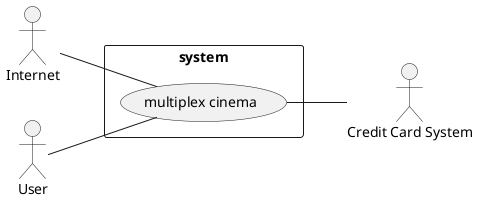
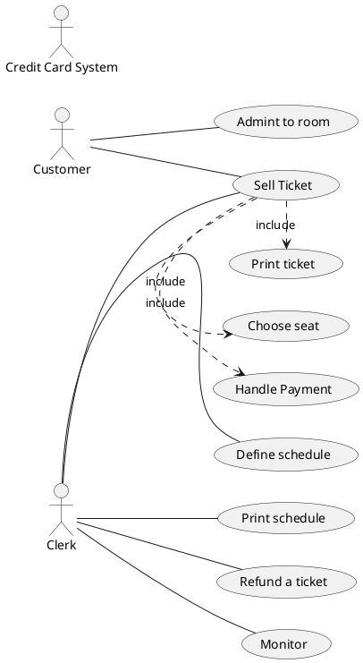

## Interfaces

```plantuml
---
```

## Use Cases Diagram



## Scenarios 

### Successful sale for a ticket for a movie

Precondition: at least one seat is available for the selected show

Post condition: selected seat now occupied

| Scenario ID: SC1 | Correspons to US: Sell Ticket |
| ---------------- | :----------------------------: |
| Step# | Description |
| 1 | Customer selects show |
| 2 | Customer selects seats |
| 3 | Customer pays |
| 4 | System sets the seat as occupied, decreases the total number of seats available |

### Successful admission to a room

Precondition: customer as a valid ticket for show and room

Post condition: the seat now occupied

| Scenario ID: SC2 | Correspons to US: Admit to Room |
| ---------------- | :----------------------------: |
| Step# | Description |
| 1 | Customer shows ticket to the barcode reader |
| 2 | System checks if the ticket is valid for show and room |
| 3 | Room gate opens, customer enters |
| 4 | System sets ticket as used, and the seat as occupied |